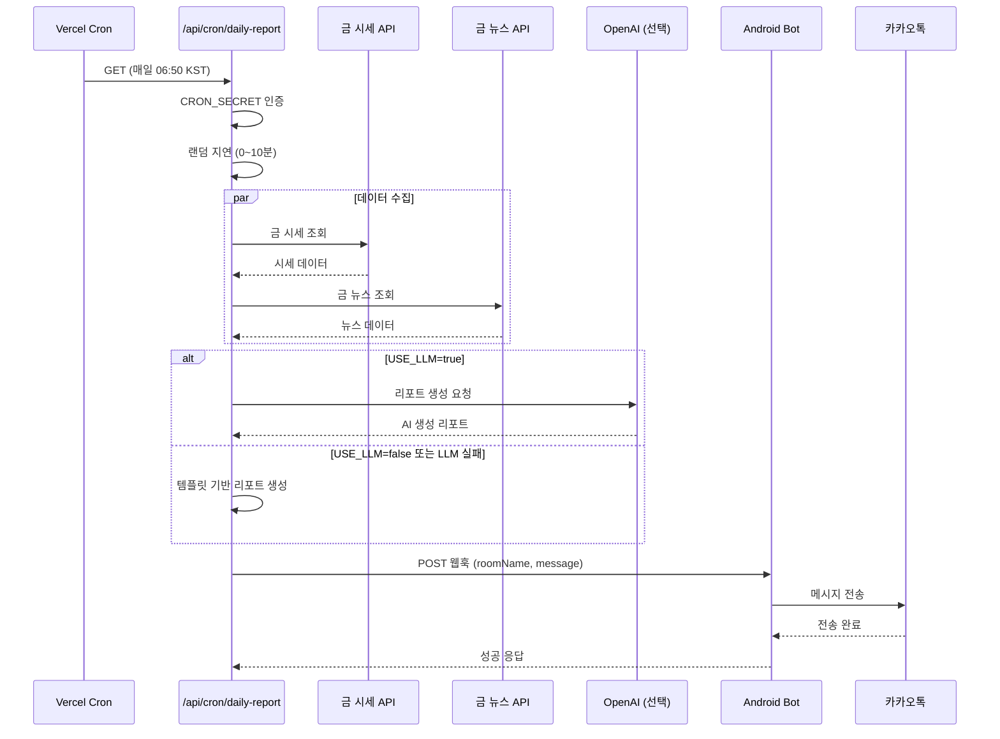
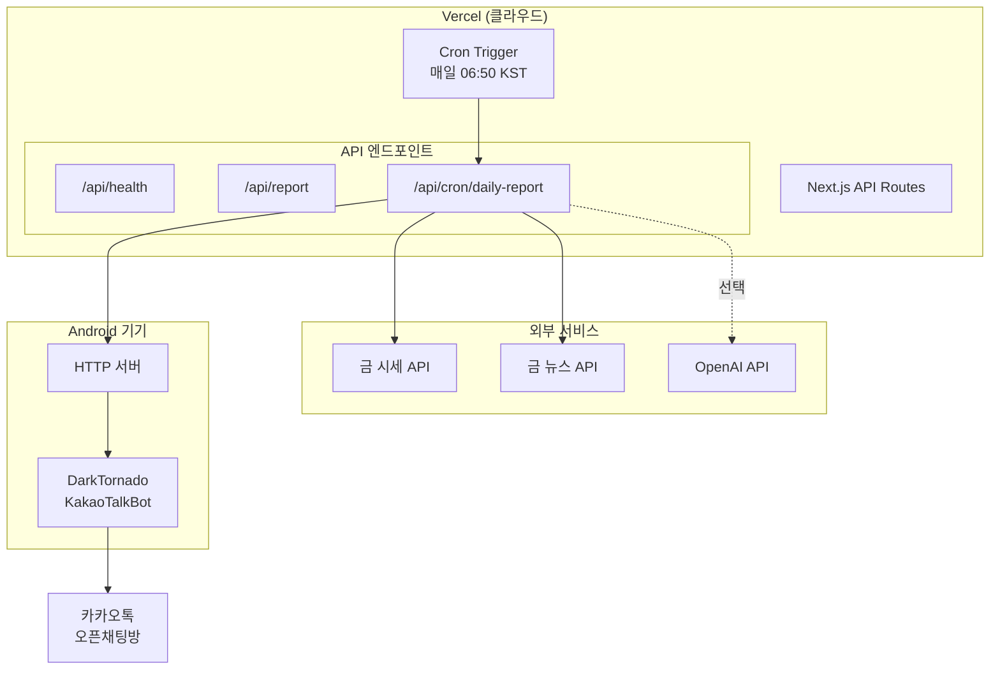
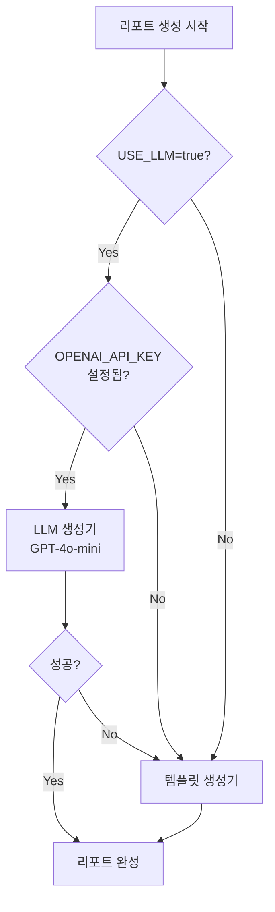

# Goldie Bot

카카오톡 오픈채팅방에 매일 금 시세 리포트를 자동 전송하는 스케줄링 서버

## 시스템 흐름



## 아키텍처



## 리포트 생성 전략



## 프로젝트 구조

```
goldie-bot/
├── apps/
│   └── scheduler/                 # Next.js 스케줄러 앱
│       ├── src/
│       │   ├── app/
│       │   │   └── api/
│       │   │       ├── cron/daily-report/   # Vercel Cron 엔드포인트
│       │   │       ├── health/              # 헬스체크
│       │   │       └── report/              # 수동 리포트 생성
│       │   └── lib/
│       │       ├── api/           # API 클라이언트
│       │       ├── config/        # 환경변수 설정
│       │       ├── report/        # 리포트 생성기
│       │       └── scheduler/     # 스케줄링 유틸리티
│       └── vercel.json            # Vercel Cron 설정
├── packages/
│   └── shared/                    # 공유 타입 및 유틸리티
└── turbo.json                     # Turborepo 설정
```

## 환경변수

```bash
# 사내 금 시세/뉴스 API
GOLD_API_BASE_URL=https://api.example.com
GOLD_API_KEY=your-api-key

# LLM 설정 (선택)
OPENAI_API_KEY=sk-xxx
USE_LLM=false                      # true: LLM 사용, false: 템플릿 사용

# 안드로이드 봇 웹훅
WEBHOOK_URL=http://your-android:8080/send
WEBHOOK_SECRET=webhook-secret

# 스케줄러 설정
TARGET_ROOM_NAME=금시세알림방
CRON_SECRET=cron-secret            # Vercel Cron 인증용
```

## API 엔드포인트

### `GET /api/health`
헬스체크

### `GET /api/report`
리포트 미리보기 (웹훅 전송 없음)

### `POST /api/report`
리포트 생성 및 웹훅 전송

```bash
curl -X POST http://localhost:3000/api/report \
  -H "Content-Type: application/json" \
  -d '{"sendToWebhook": true}'
```

### `GET /api/cron/daily-report`
Vercel Cron 전용 엔드포인트

- `CRON_SECRET` 헤더 인증 필요
- 프로덕션에서 0~10분 랜덤 지연 적용

## 리포트 생성 방식

### 1. 템플릿 기반 (기본값)
`USE_LLM=false`일 때 사용. 고정된 포맷으로 리포트 생성.

```
🥇 금 시세 일일 리포트

📅 2026-01-10

💰 현재가: 86,500원
📈 전일대비: +1,200원 (+1.41%)

📰 오늘의 금 관련 뉴스
1. 미 연준 금리 동결, 금값 상승세
   연준의 금리 동결 결정으로...

⏰ 발송 시각: 오전 07:23
```

### 2. LLM 기반 (선택)
`USE_LLM=true`이고 `OPENAI_API_KEY` 설정시 사용. GPT-4o-mini로 자연스러운 리포트 생성.

LLM 호출 실패시 자동으로 템플릿으로 폴백.

## Vercel 배포

### 1. 프로젝트 연결
```bash
vercel link
```

### 2. 환경변수 설정
Vercel 대시보드 → Settings → Environment Variables에서 설정

### 3. 배포
```bash
vercel --prod
```

### 4. Cron 확인
Vercel 대시보드 → Settings → Crons

**Cron 스케줄:** `50 21 * * *` (UTC) = 매일 06:50 KST

## 안드로이드 봇 설정

[DarkTornado KakaoTalkBot](https://github.com/darktornado/KakaoTalkBot) 사용

봇 스크립트에 HTTP 서버 추가 필요:

```javascript
// 봇 스크립트 예시
const server = new java.net.ServerSocket(8080);

while (true) {
  const client = server.accept();
  const reader = new java.io.BufferedReader(
    new java.io.InputStreamReader(client.getInputStream())
  );

  // POST 요청 파싱
  let body = "";
  // ... 요청 읽기

  const data = JSON.parse(body);
  Bot.send(data.roomName, data.message);

  client.close();
}
```

## 개발

### 설치
```bash
pnpm install
```

### 개발 서버
```bash
pnpm dev
```

### 빌드
```bash
pnpm build
```

### 린트 + 포맷
```bash
pnpm lint
```

### 타입 체크
```bash
pnpm typecheck
```

## 기술 스택

- **모노레포:** Turborepo + pnpm
- **프레임워크:** Next.js 16
- **언어:** TypeScript
- **LLM:** Vercel AI SDK + OpenAI
- **스케줄링:** Vercel Cron
- **린트:** ESLint + Prettier
