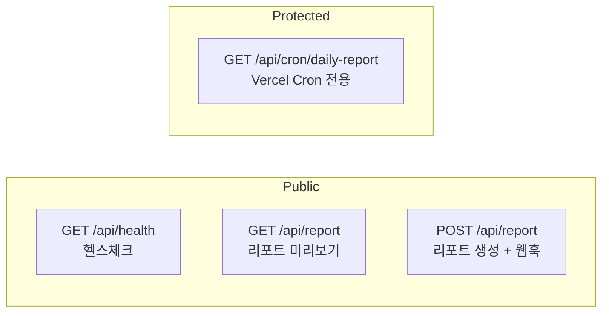

# @goldie/scheduler

금 시세 일일 리포트 스케줄링 서버

## 개요

매일 아침 금 시세와 뉴스를 수집하여 카카오톡 오픈채팅방에 리포트를 전송하는 Next.js 애플리케이션

## API 엔드포인트



### `GET /api/health`

서버 상태 확인

```json
{
  "status": "healthy",
  "timestamp": "2026-01-10T07:00:00.000Z",
  "version": "0.0.1"
}
```

### `GET /api/report`

리포트 미리보기 (웹훅 전송 없음)

```json
{
  "success": true,
  "data": { "price": {...}, "news": [...] },
  "report": {
    "message": "🥇 금 시세 일일 리포트...",
    "generatedBy": "template",
    "generatedAt": "2026-01-10T07:00:00.000Z"
  }
}
```

### `POST /api/report`

리포트 생성 및 웹훅 전송

```bash
curl -X POST http://localhost:3000/api/report \
  -H "Content-Type: application/json" \
  -d '{"sendToWebhook": true}'
```

### `GET /api/cron/daily-report`

Vercel Cron 전용 엔드포인트

- `Authorization: Bearer {CRON_SECRET}` 헤더 필요
- 프로덕션에서 0~10분 랜덤 지연 적용

## 디렉토리 구조

```
src/
├── app/
│   ├── api/
│   │   ├── cron/daily-report/   # Cron 엔드포인트
│   │   ├── health/              # 헬스체크
│   │   └── report/              # 리포트 API
│   ├── layout.tsx
│   └── page.tsx
└── lib/
    ├── api/                     # 외부 API 클라이언트
    │   ├── gold-price.ts        # 금 시세 API
    │   ├── gold-news.ts         # 금 뉴스 API
    │   └── webhook.ts           # 안드로이드 봇 웹훅
    ├── config/
    │   └── env.ts               # 환경변수 설정
    ├── report/                  # 리포트 생성기
    │   ├── generator.ts         # 메인 생성기 (전략 패턴)
    │   ├── template-generator.ts
    │   ├── llm-generator.ts
    │   └── types.ts
    └── scheduler/
        └── random-delay.ts      # 랜덤 지연 유틸리티
```

## 환경변수

| 변수 | 필수 | 설명 |
|------|:----:|------|
| `GOLD_API_BASE_URL` | ✅ | 금 시세/뉴스 API 기본 URL |
| `GOLD_API_KEY` | | API 인증 키 |
| `WEBHOOK_URL` | ✅ | 안드로이드 봇 웹훅 URL |
| `WEBHOOK_SECRET` | | 웹훅 인증 시크릿 |
| `TARGET_ROOM_NAME` | | 카카오톡 채팅방 이름 (기본: 금시세알림방) |
| `CRON_SECRET` | | Vercel Cron 인증 시크릿 |
| `USE_LLM` | | LLM 사용 여부 (true/false) |
| `OPENAI_API_KEY` | | OpenAI API 키 (LLM 사용시) |

## 스크립트

```bash
pnpm dev        # 개발 서버 (http://localhost:3000)
pnpm build      # 프로덕션 빌드
pnpm start      # 프로덕션 서버
pnpm lint       # ESLint + Prettier
pnpm typecheck  # TypeScript 타입 체크
```

## Vercel 배포

`vercel.json`에 Cron 설정 포함:

```json
{
  "crons": [{
    "path": "/api/cron/daily-report",
    "schedule": "50 21 * * *"
  }]
}
```

> `50 21 * * *` (UTC) = 매일 06:50 KST
